# Informe de desarrollo

Este informe tiene un detalle de avance semanal del desarrollo realizado por parte de [@juanesrealnet](https://www.github.com/juanesrealnet):

## Semana 1 - (30/06/2025 - 04/07/2025)
> - Creación de la pestaña de `entrega` y `recepción`.
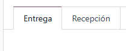
> - Implementación del `botón` que da apertura a la `cámara` para tomar `fotos` y `videos` en vivo.
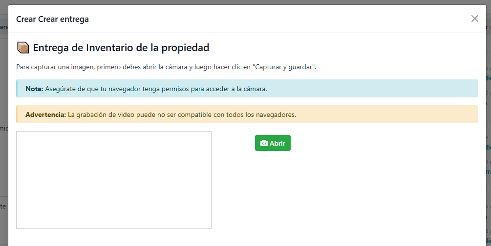
> - Funcionalidad de grabación y captura de imágenes por parte del botón de `cámara`, habilitando los permisos como es debido.
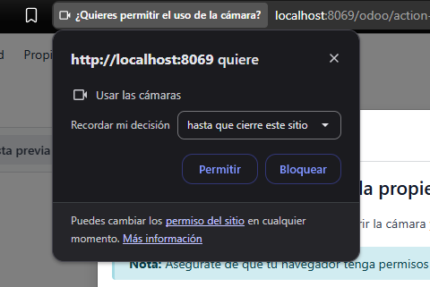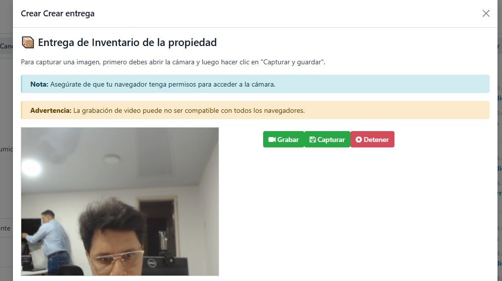

## Semana 2 - (07/07/2025 - 11/07/2025)

> - Para las pestañas de `Recepción` y `Entrega` en la vista de Contratos, se adicionan los campos correspondientes por cada formulario.
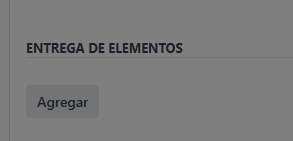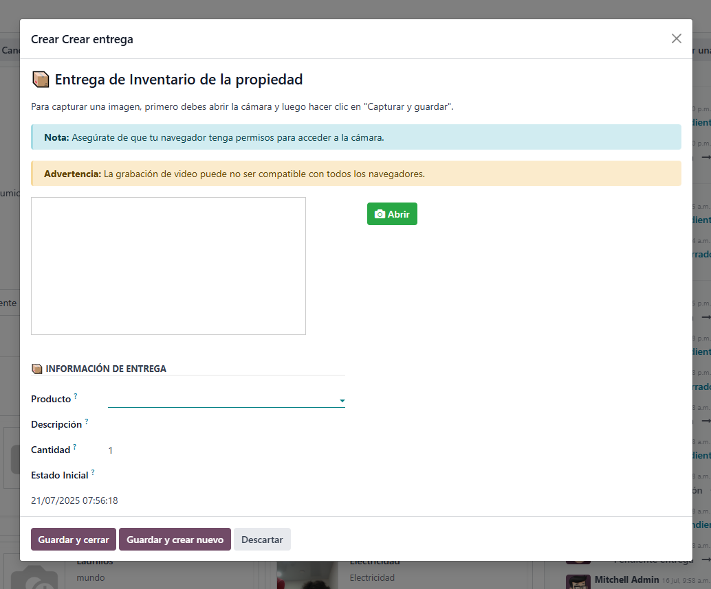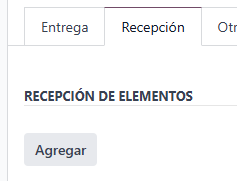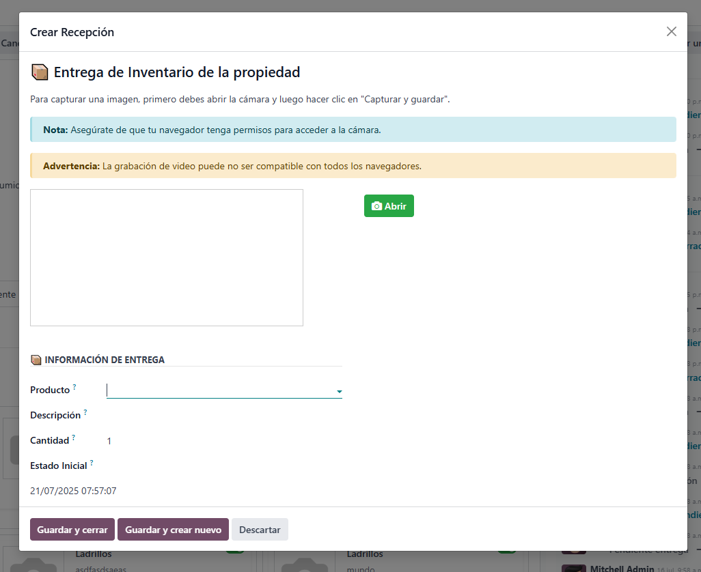
> - Implementación de las `tarjetas` para su debida visualización.
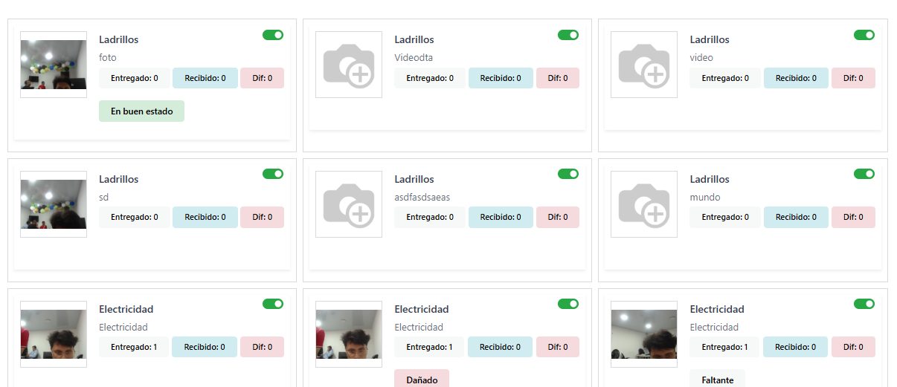
> - Cargar `modal` por cada clic en las tarjetas para ver el detalle de la misma.
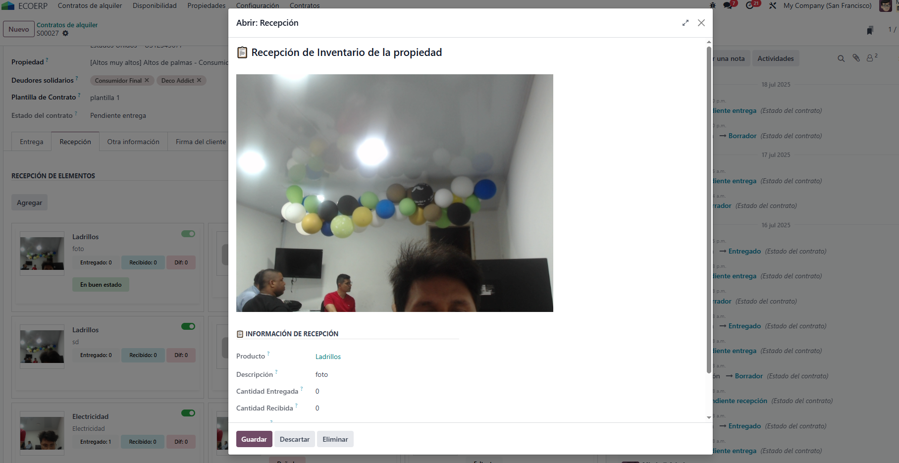
> - Se agrega el botón `slide` en recepción para validar si el item está o no como corresponde según regla de negocio y se verifica que guarde en `DB`.
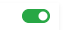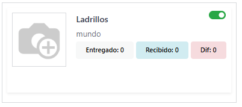

## Semana 3 - (14/07/2025 - 18/07/2025)

> - Mejora de visualización por parte de las tarjetas.
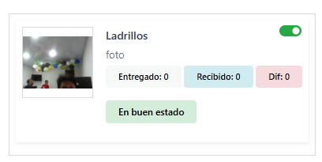
> - Mejora de visualización por parte de los `modals`.
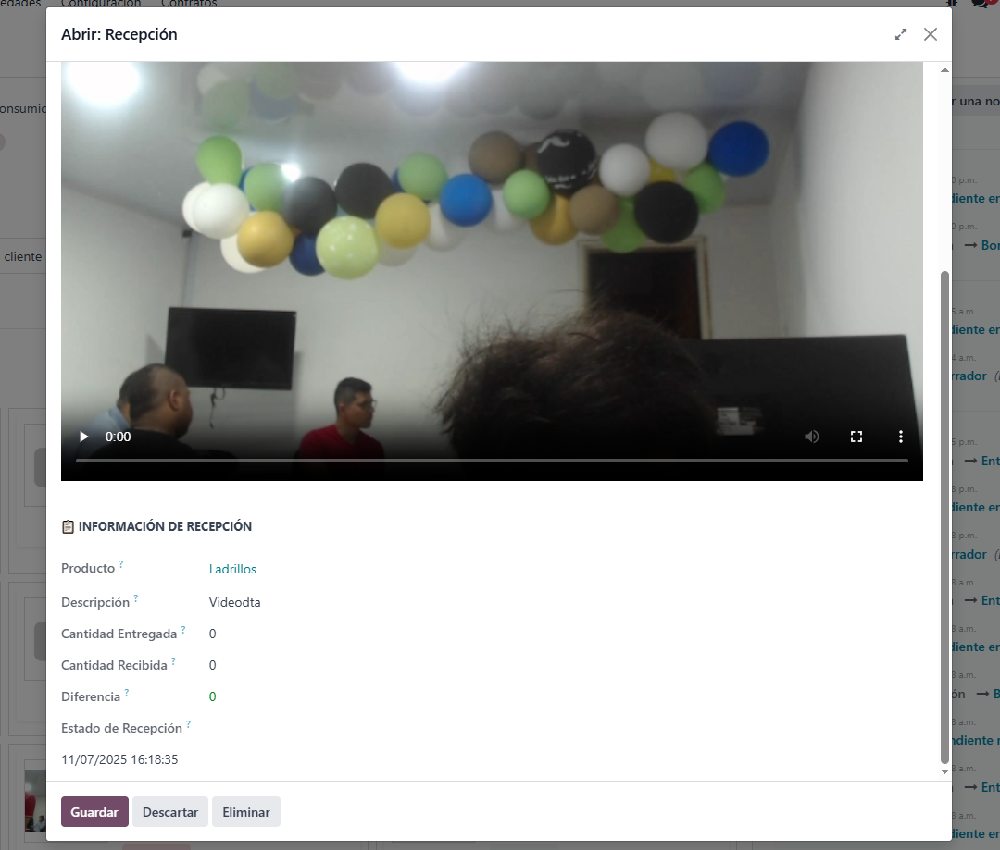
> - Validación de existencia `archivos` en el detalle generados por la  `cámara`.
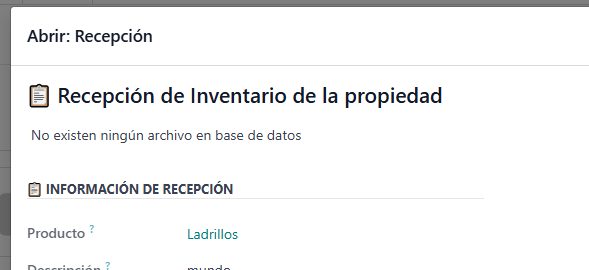
> - Adición del botón `Otro sí`.
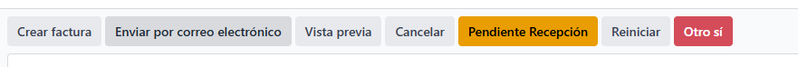

## semana 4 - (21/07/2025 - 25/07/2025)

> - Validación en entrega y recepción para permitir registros solo si no existe inventario.
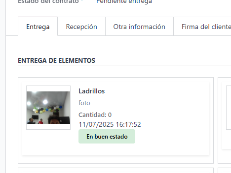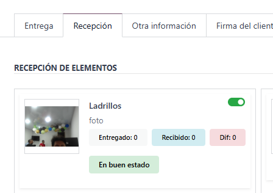
> - Validación de recepción para continuar el cambio de estado con el guardado de recepción sino existen productos marcados.
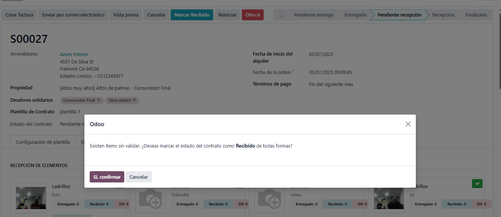

## Responsable

- [@juanesrealnet](https://www.github.com/juanesrealnet)

