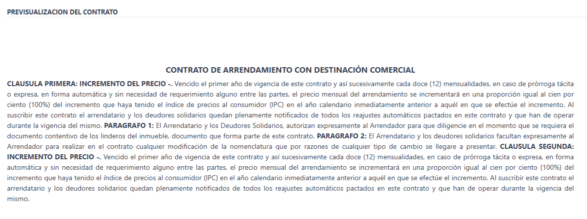

# Informe de Avance 18-07-2025

## Resumen

Este informe detalla el progreso realizado en el desarrollo del módulo `industry_real_estate` de Odoo y un cambio en producción de `Happy Parking`, basado en los avances realizados en la semana del 14 al 18 de julio.

## Funcionalidades Implementadas

- **Corrección archivo XML DIAN - Happy Parking:**
    - Se descargó una copia de la base de datos neutralizada y se corrió el proyecto en local para realizar test
    - Se estudió e identificó como funcionaba la estructura del envío de facturas a la DIAN
    - Se mapeó el campo de notas y se agregó en el XML enviado a la DIAN
    - Se realiza test de mapeo de campo y se encuentra ok
    - Se informa a will para realizar un test de envío de una factura real a la DIAN y sale exitoso.

- **Estructura de los paragrafos:**  
    Se crea un campo de parent_clause_line_id para organizar la estructura de como se asocian los paragrafos a las clausulas para mostrar el orden

- **Previsualización de clausulas al crear un contrato nuevo:**  
    - Se implementó la funcionalidad para mostrar el titulo de la clausula, la numeración en numero ordinal para las clausulas, la numeración de los paragrafos en número y cuando solo existe un paragrafo para esa clausula, no poner numeración.
    - Se quitó el salto de linea entre cada clausula y paragrafo para que se mostrara de forma continua.
  
        

## Pendiente

- Agregar campo de dirección estructurado y que se pueda integrar con geolocalización
- Implementar nuevos cambios generados en la reunión del viernes 18:
    - Para cada clausula boton de vista (un svg de un ojo - representación vista) para posicionarme dentro del texto en la previsualización y que tenga un background amarillo
    - Agregar un identado a la estructura en donde se agregan las clausulas para que se vea identado los paragrafos.
    - Quitar columna parent y que la asociación se haga por orden
    - Las variables deben resaltar en color fuerte. Opciones - Verde fuerte - Azul - verde del logo
    - Cuando se vaya a imprimir debe imprimir sin colores
- En Happy Parking, agregar un campo OrderReference para mostrar el xml y relacionado a la misma variable note

---
**Fecha:** 21-07-2025  
**Responsable:** Cristian Maya Gallego